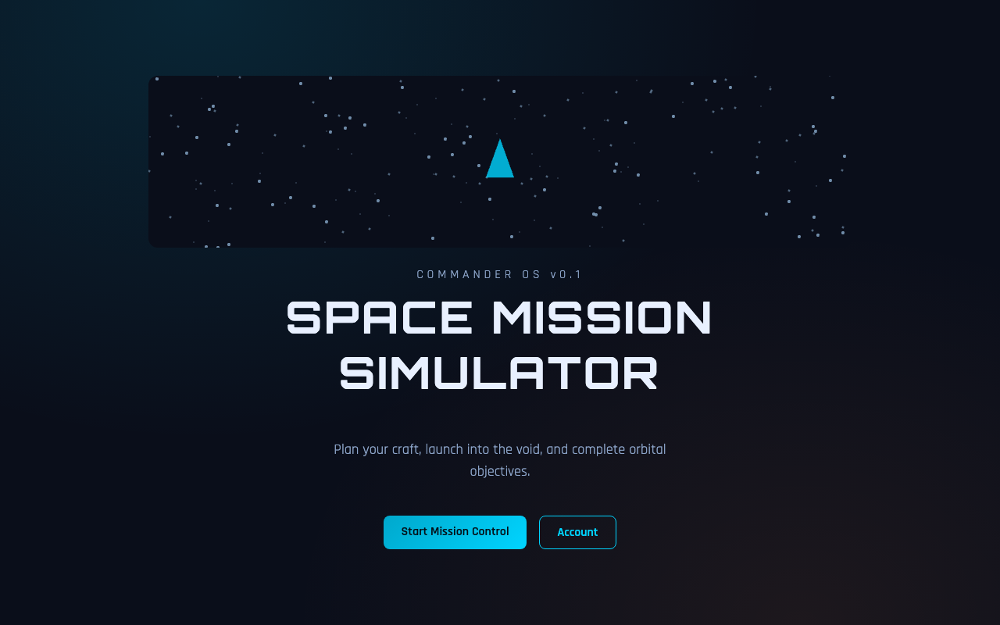
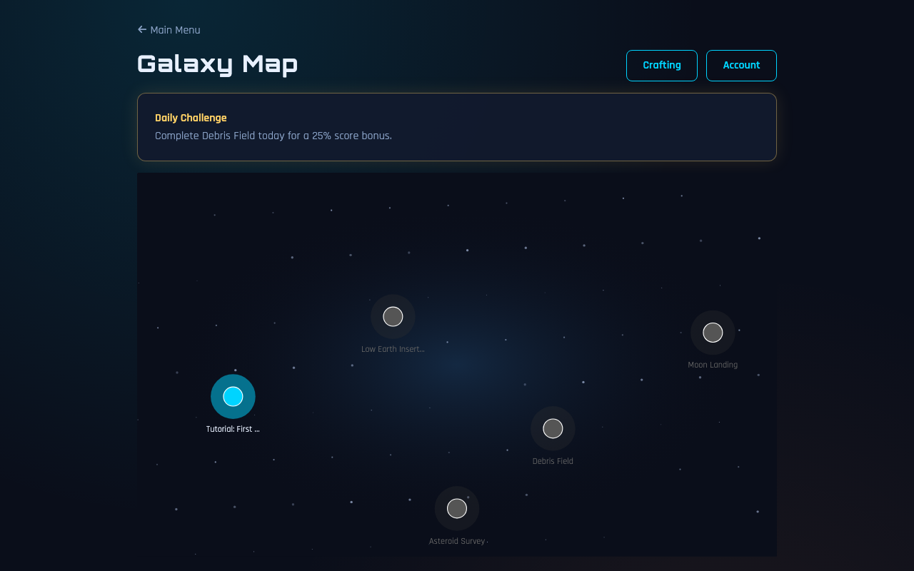

# Space Mission Simulator

Browser-based space mission game with **Python (FastAPI)** simulation and **React + Phaser** visuals.





## Monorepo layout

```
Space-Mission-Simulator/
├── package.json          # root scripts — build/dev from here
├── frontend/             React + Vite + Phaser
├── backend/              FastAPI + simulation engine
├── docs/sds.md
└── docker-compose.yml
```

## Quick start (from repo root)

### Prerequisites

- Python 3.12+
- Node.js 20+

### Install everything

```bash
npm run install:all
```

### Development (API + frontend together)

```bash
npm run dev
```

- **Game UI:** [http://localhost:5290](http://localhost:5290) — open the root `/`, not `/review` (that path belongs to other apps)
- API: [http://localhost:8100](http://localhost:8100)

> **Ports reserved for this project only:** web **5290**, API **8100**.  
> Do not use 5173–5175 (sellerPort, Math World, etc.) or 8000–8001 for this app.

### Build (from root)

```bash
npm run build
```

| Script | What it does |
|--------|----------------|
| `npm run build` | Frontend production build + backend compile check |
| `npm run build:web` | `frontend/dist` only |
| `npm run build:api` | `compileall` on `backend/app` |
| `npm test` | Backend pytest + frontend build |
| `npm run test:api` | Backend tests only |
| `npm run seed` | Load YAML missions into the database |
| `npm run screenshot` | Capture `docs/screenshots/*.png` (app must be on :5290) |

### Run production API only

```bash
npm run start:api
```

Serve the built frontend separately (`npm run preview:web` after `npm run build:web`).

## Docker (full stack)

| Service | URL |
|---------|-----|
| **Game UI** | http://localhost:5290 |
| API (direct) | http://localhost:8100 |

Use the **Game UI** link (root `/`). Nginx proxies `/api` and `/ws` to the API container.

```bash
npm run docker:up
# or: docker compose up -d --build
```

If you change ports in `docker-compose.yml`, run `npm run docker:down` first, then `docker:up` again (old containers keep the previous port mapping).

Custom ports (copy `.env.example` → `.env`):

```bash
cp .env.example .env
# edit API_HOST_PORT / WEB_HOST_PORT
docker compose up --build
```

## Features

| Phase | Delivered |
|-------|-----------|
| **0 — Scaffold** | Monorepo, Docker, GitHub CI, Phaser boot starfield |
| **1 — Core loop** | Guest session, WebSocket sim @ 20Hz, HUD, debrief |
| **2 — Polish** | Galaxy map, hangar loadout → sim, medals, particles |
| **3 — Accounts** | Register/login, guest progress merge, replay keyframes |
| **4 — Scale** | 5 missions, crafting bay, daily challenge |

## Missions

| Mission | Objective |
|---------|-----------|
| Tutorial: First Ignition | Hold ≥ 80 km for 5 s |
| Low Earth Insertion | Orbit 200–280 km for 5 s |
| Debris Field | Reach beacon |
| Asteroid Survey | Survey orbit 150–220 km for 6 s |
| Moon Landing | Soft-land on lunar beacon |

## Game flow

Main menu → Galaxy map → Briefing → Hangar → Flight → Debrief → Crafting / Account

**Controls:** W or ↑ thrust · A/D rotate · on-screen buttons for touch

## Architecture

- Server-authoritative physics (duck-typed components)
- Mission YAML in `backend/content/missions/`
- See [docs/sds.md](docs/sds.md)
