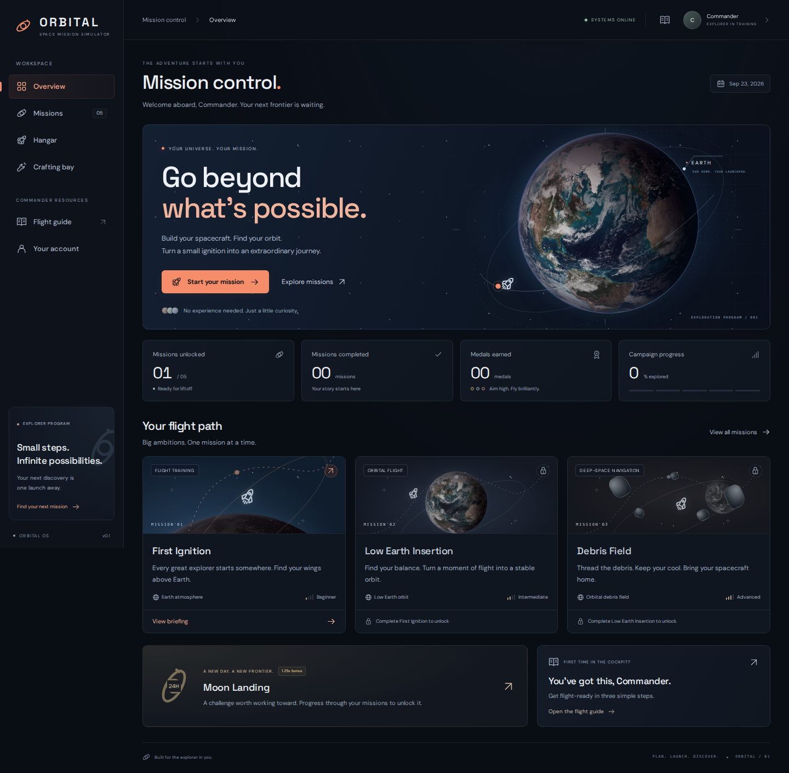
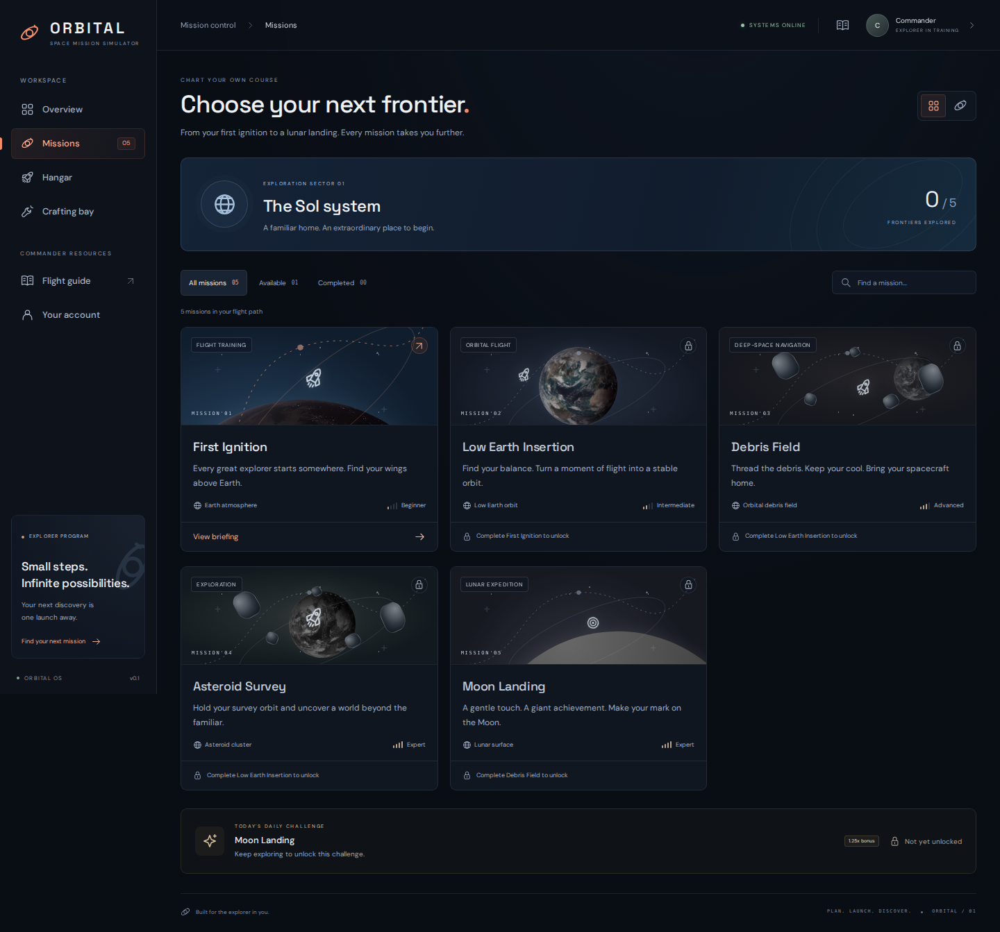
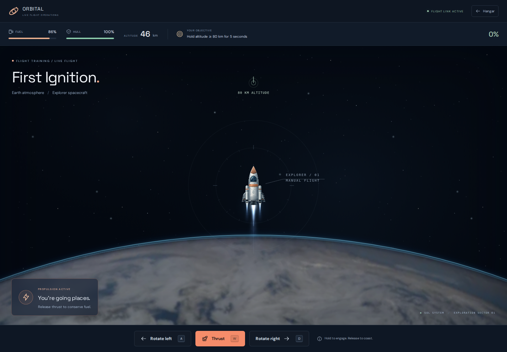

# Orbital — Space Mission Simulator

Browser-based space mission game with **Python (FastAPI)** simulation and **React + Phaser** visuals.







## Your flight deck

- **Mission control:** an orbital overview with your actual unlocked missions, medals,
  campaign progress, and daily challenge. Start your next available mission in one click.
- **Missions:** search and filter the mission catalog, or switch to the keyboard-accessible
  galaxy map. Locked missions explain exactly which prerequisite to complete.
- **Briefing → configure → launch:** a guided preparation flow, spacecraft preview,
  selectable modules, and a live mass budget. The flight engine and spacecraft artwork load
  before allocating a run, with recoverable download deadlines. Direct links and page
  refreshes work in the hangar.
- **Cockpit:** fly the same detailed Explorer spacecraft shown in the hangar, with
  metallic hull panels, thermal tiles, reflective cockpit glass, and engine-bell detail.
  Blue-white engine cores sit inside soft, expanding exhaust, against NASA Earth
  photography and a lit lunar surface map. The Moon has no atmospheric glow, and
  debris has textured, irregular surfaces. This is a visual realism upgrade;
  the existing server-authoritative flight physics and mission rules are unchanged.
  Keyboard and touch controls have clear instructions, explicit connection errors,
  and confirmation before leaving a flight.
- **Flight guide, crafting, and account:** learn the controls, discover upgrades,
  and save your guest progress. Loading, empty, and error states explain what to do next.

Desktop navigation becomes a bottom navigation bar on phones. The interface includes
visible keyboard focus, focus transitions into and out of the cockpit, labelled forms,
a skip link, and reduced-motion support. Mission unlocks keep refreshing if you leave
the debrief early; a failed progress refresh provides an explicit retry.

## Monorepo layout

```
Space-Mission-Simulator/
├── package.json          # root scripts — build/dev from here
├── frontend/             React + Vite + Phaser
├── backend/              FastAPI + simulation engine
├── docs/sds.md
└── docker-compose.yml
```

## Quick start (from repo root)

### Prerequisites

- Python 3.12+
- Node.js 20+

### Install everything

```bash
npm run install:all
```

### Development (API + frontend together)

```bash
npm run dev
```

- **Game UI:** [http://localhost:5290](http://localhost:5290) — open the root `/`, not `/review` (that path belongs to other apps)
- API: [http://localhost:8100](http://localhost:8100)

> **Ports reserved for this project only:** web **5290**, API **8100**.  
> Do not use 5173–5175 (sellerPort, Math World, etc.) or 8000–8001 for this app.

### Build (from root)

```bash
npm run build
```

| Script | What it does |
|--------|----------------|
| `npm run build` | Frontend production build + backend compile check |
| `npm run build:web` | `frontend/dist` only |
| `npm run build:api` | `compileall` on `backend/app` |
| `npm test` | Backend pytest + frontend build |
| `npm run test:api` | Backend tests only |
| `npm run test:ui` | Desktop and phone browser checks against the running app |
| `npm run seed` | Load YAML missions into the database |
| `npm run screenshot` | Capture `docs/screenshots/*.png` (app must be on :5290) |

### Browser checks and screenshots

With the frontend and API running, install Chromium once:

```bash
npx playwright install chromium
npm run test:ui
npm run screenshot
```

Browser checks cover the real guest session and training flight, progress persistence,
mission filtering, keyboard navigation, loadout selection, pointer/keyboard flight input,
account registration/sign-in, responsive layouts, and recoverable API failures. Each test
uses an isolated browser session but creates test accounts and flight records in the
running API; use a disposable database for these checks. Failure traces and screenshots
go in the ignored `test-results/` directory.
Set `UI_BASE_URL` or `SCREENSHOT_BASE` to use a different running instance.

Flight artwork checks use fixed WebSocket snapshots and intercepted run creation to
compare the actual canvas on desktop, phone, and short landscape screens. These visual
fixtures are separate from the real training-flight test. They also cover spacecraft
rotation, engine shutoff, and artwork failures before run allocation. After an intentional
visual change, review the images before accepting new baselines with
`npm run test:ui -- tests/ui/flight-visuals.spec.mjs --update-snapshots`.
The screenshot script captures a real engine burn as well as mission control and the catalog.

The backend keeps bcrypt below version 5 for compatibility with its existing Passlib
password backend. Install from `backend/requirements.txt` rather than upgrading bcrypt
independently.

### Run production API only

```bash
npm run start:api
```

Serve the built frontend separately (`npm run preview:web` after `npm run build:web`).

## Docker (full stack)

| Service | URL |
|---------|-----|
| **Game UI** | http://localhost:5290 |
| API (direct) | http://localhost:8100 |

Use the **Game UI** link (root `/`). Nginx proxies `/api` and `/ws` to the API container.

```bash
npm run docker:up
# or: docker compose up -d --build
```

If you change ports in `docker-compose.yml`, run `npm run docker:down` first, then `docker:up` again (old containers keep the previous port mapping).

Custom ports (copy `.env.example` → `.env`):

```bash
cp .env.example .env
# edit API_HOST_PORT / WEB_HOST_PORT
docker compose up --build
```

## Features

| Phase | Delivered |
|-------|-----------|
| **0 — Scaffold** | Monorepo, Docker, GitHub CI, Phaser boot starfield |
| **1 — Core loop** | Guest session, WebSocket sim @ 20Hz, HUD, debrief |
| **2 — Polish** | Galaxy map, hangar loadout → sim, medals, particles |
| **3 — Accounts** | Register/login, guest progress merge, replay keyframes |
| **4 — Scale** | 5 missions, crafting bay, daily challenge |

## Missions

| Mission | Objective |
|---------|-----------|
| Tutorial: First Ignition | Hold ≥ 80 km for 5 s |
| Low Earth Insertion | Orbit 200–280 km for 5 s |
| Debris Field | Reach beacon |
| Asteroid Survey | Survey orbit 150–220 km for 6 s |
| Moon Landing | Soft-land on lunar beacon |

## Game flow

Mission control → Mission catalog / Galaxy map → Briefing → Hangar → Flight → Debrief → Crafting / Account

**Controls:** W or ↑ thrust · A/D or ←/→ rotate · hold on-screen buttons for touch.
Releasing a button outside its bounds, losing focus, or switching tabs clears held input.

## Architecture

- Server-authoritative physics (duck-typed components)
- Mission YAML in `backend/content/missions/`
- See [docs/sds.md](docs/sds.md)

## Image credit

All imagery is served locally; flying a mission does not contact NASA or another
image service.

- `frontend/public/images/earth.webp`, used by mission control, is adapted from
  **NASA / Reto Stöckli, NASA Blue Marble 2007 West**, with data from NASA and NOAA.
  [Source and credit](https://science.nasa.gov/image-detail/amf-gsfc_20171208_archive_e002131/).
- `frontend/public/images/earth-flight.webp` uses **NASA / NOAA DSCOVR EPIC**
  photography from July 6, 2015, frame `epic_1b_20150706191138`.
  The black border was cropped and the image converted to WebP.
  [Original photograph](https://epic.gsfc.nasa.gov/archive/natural/2015/07/06/png/epic_1b_20150706191138.png).
- `frontend/public/images/moon-surface.webp` is adapted from the **NASA Goddard
  Scientific Visualization Studio CGI Moon Kit**, using LRO/LROC surface data.
  The color map is converted to WebP, projected onto a sphere, and lit by the
  renderer. Small patches also supply illustrative rock detail, not a map of
  a real asteroid. [Source and credits](https://svs.gsfc.nasa.gov/4720/).

Lighting, atmospheric effects, and exhaust are illustrative game rendering, not
scientific measurements. The spacecraft artwork is shared between the hangar and flight.
Use follows [NASA's images and media guidelines](https://www.nasa.gov/nasa-brand-center/images-and-media/).
This independent simulator is not affiliated with or endorsed by NASA.
