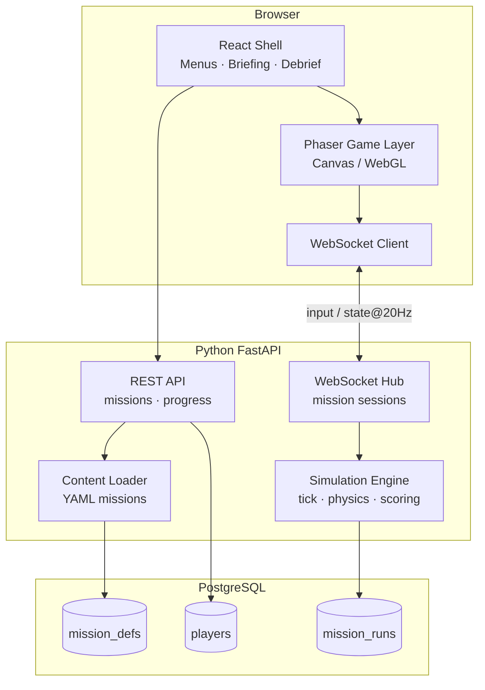
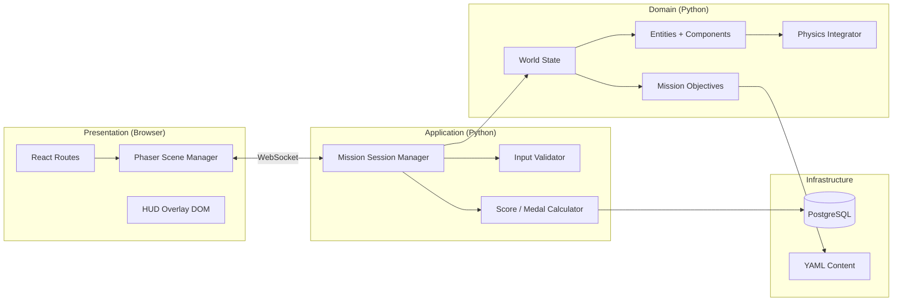
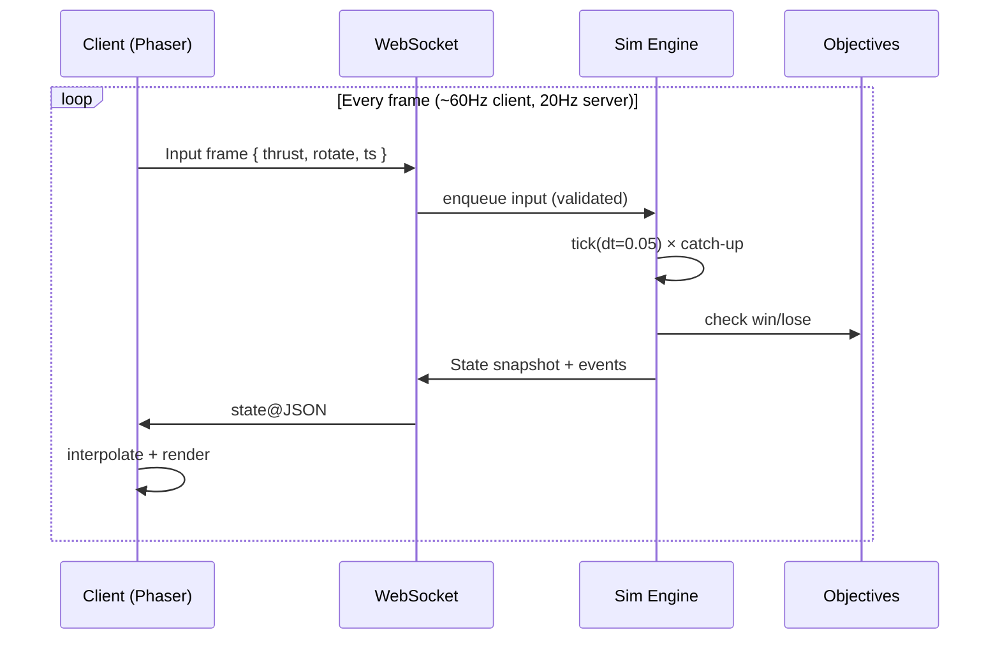
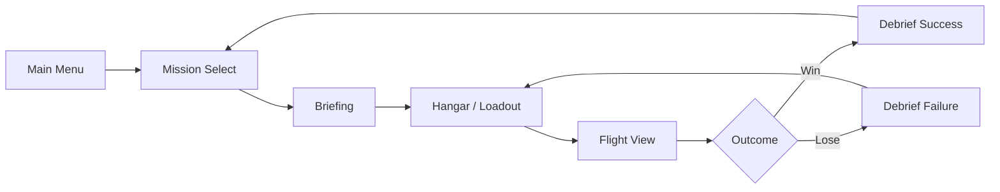
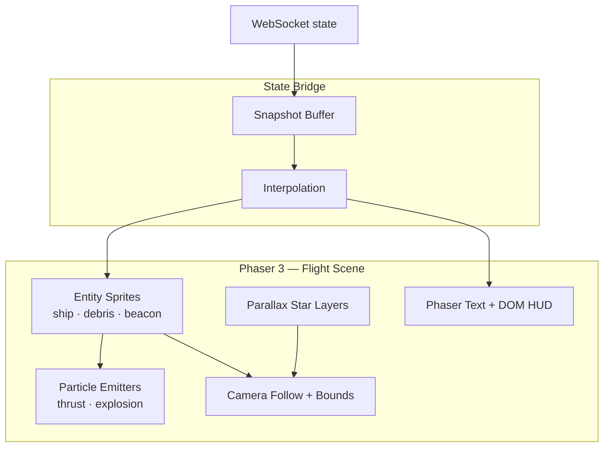
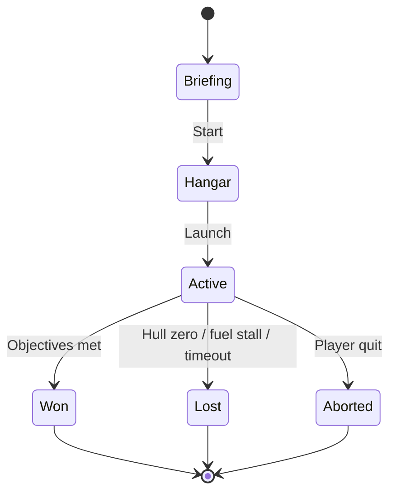
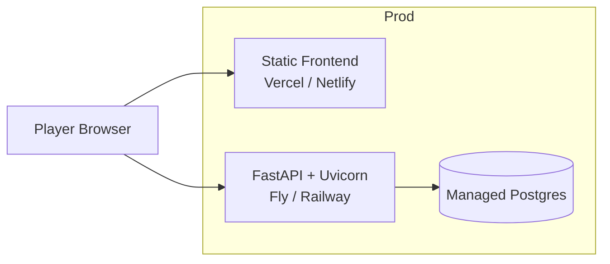

# Software Design Specification (SDS)
## Space Mission Simulator — Web-Based Space Mission Game

**Version:** 0.1  
**Status:** Draft  
**Repository:** `Space-Mission-Simulator`

---

## 1. Executive Summary

**Space Mission Simulator** is a browser-based game where players plan and fly space missions: assemble a craft, launch, navigate hazards, manage fuel and systems, and complete objectives (orbit insertion, docking, landing). The **Python backend** owns mission rules, physics ticks, scoring, and persistence; the **web client** delivers real-time **visuals** (starfield, spacecraft, HUD, mission briefing) via Canvas/WebGL.

Core loop: **briefing → configure craft → launch → fly (real-time) → debrief → unlock next mission**.

This document specifies architecture, visuals pipeline, duck-typed simulation components, APIs, data models, and a phased delivery plan for an MVP that proves: **one playable mission with polished 2D space visuals and authoritative server simulation**.

---

## 2. Goals and Non-Goals

### 2.1 Goals

| ID | Goal |
|----|------|
| G1 | Playable MVP: mission select, one launch-to-orbit mission, win/lose debrief |
| G2 | **Authoritative simulation on Python** — client renders state; server validates inputs |
| G3 | **Strong visuals**: parallax starfield, thrust particles, HUD, camera follow |
| G4 | **Duck-typed components** — any object with `update(dt)` / `render(ctx)` can plug in |
| G5 | Missions and craft modules defined in YAML without redeploying client assets |
| G6 | 60 FPS target on mid-range laptops; graceful degrade on low-end devices |

### 2.2 Non-Goals (v1)

- Full N-body orbital mechanics (use simplified 2D physics)
- Multiplayer / competitive leaderboards
- VR or native mobile apps
- Procedural infinite galaxy
- Paid accounts or monetization
- 3D cockpit view (2.5D top/side view only in v1)

---

## 3. Recommended Technology Stack

| Layer | Choice | Rationale |
|-------|--------|-----------|
| **Frontend** | React 18 + TypeScript + Vite | UI shells (menus, briefing); integrates with game canvas |
| **Game rendering** | **Phaser 3** (Canvas/WebGL) | Built-in sprites, particles, camera, tweens; fast MVP visuals |
| **State (UI)** | Zustand | Mission select, settings, debrief modals |
| **Realtime sync** | WebSocket (`/ws/mission/{id}`) | Low-latency input + state snapshots |
| **Backend** | Python 3.12 + **FastAPI** | Async WebSockets, OpenAPI for REST |
| **Simulation** | Pure Python tick loop (no GIL escape in v1) | Duck-typed entities; testable without browser |
| **Database** | PostgreSQL (SQLite local) | Profiles, mission progress, replays metadata |
| **ORM** | SQLAlchemy 2 + Alembic | Migrations |
| **Content** | YAML in `backend/content/missions/` | Missions, hazards, craft modules |
| **Hosting** | Static frontend + API container | Standard split deploy |

**Legacy note:** The repo contains a Java GWT helicopter prototype (`src/com/skorulis/heli/`). The greenfield design below **replaces** that stack; entity/update/render interfaces in the legacy code informed the duck-typing model in §6.4.

---

## 4. System Context



---

## 5. Game Design Overview

### 5.1 Player fantasy

You are a mission commander. Each mission has a **briefing** (objective, constraints), a **pre-flight** phase (pick modules within mass budget), then **flight** (thrust, rotate, stabilize), ending in **debrief** (score, fuel used, badges).

### 5.2 MVP mission catalog

| Mission | Objective | Win condition |
|---------|-----------|---------------|
| **Tutorial: First Ignition** | Learn thrust and rotation | Reach altitude band for 5 s |
| **Low Earth Insertion** | Circularize orbit | Stable orbit markers (apo/peri in band) |
| **Debris Field** | Navigate to beacon | Reach goal without hull ≤ 0 |

### 5.3 Scoring (v1)

- **Primary:** mission complete (boolean)
- **Secondary:** fuel remaining %, time, hull integrity
- **Medals:** Gold / Silver / Bronze thresholds per mission (YAML)

---

## 6. Application Architecture

### 6.1 Layered architecture



### 6.2 Frontend modules

| Module | Responsibility |
|--------|----------------|
| `features/menu` | Main menu, settings, credits |
| `features/mission-select` | Galaxy map / mission list, lock states |
| `features/briefing` | Story, objectives, constraints |
| `features/hangar` | Module picker, mass budget bar |
| `features/flight` | Phaser mount, WebSocket bridge, pause |
| `features/debrief` | Score, medals, retry / continue |
| `game/scenes` | `Boot`, `Starfield`, `Flight`, `Effects` |
| `game/sprites` | Ship, debris, beacon, planet |
| `game/systems` | Camera follow, parallax, particle emitters |
| `shared/api` | OpenAPI-typed REST client |

### 6.3 Backend modules

| Module | Responsibility |
|--------|----------------|
| `api/routes/missions.py` | List missions, definitions (no spoilers) |
| `api/routes/progress.py` | Player unlocks, best scores |
| `api/ws/mission.py` | WebSocket session lifecycle |
| `sim/engine.py` | Fixed timestep loop, entity registry |
| `sim/physics.py` | 2D forces, drag, simplified gravity |
| `sim/objectives.py` | Win/lose checks per mission type |
| `sim/components/` | Thrust, hull, fuel, collision, etc. |
| `content/loader.py` | YAML → mission + entity templates |
| `models/` | SQLAlchemy entities |

### 6.4 Duck typing (Python simulation)

Components are **protocols**, not deep inheritance trees. Anything that implements the required methods can attach to an entity.

```python
# backend/app/sim/protocols.py
from typing import Protocol

class Updatable(Protocol):
    def update(self, dt: float, world: "World") -> None: ...

class Collidable(Protocol):
    def bounds(self) -> tuple[float, float, float, float]: ...
    def on_collision(self, other: "Entity", world: "World") -> None: ...

class Renderable(Protocol):
    """Server sends render hints; client is authoritative for pixels."""
    def render_state(self) -> dict: ...
```

```python
# Example: fuel tank — no base class required
class FuelTank:
    def __init__(self, capacity: float):
        self.capacity = capacity
        self.remaining = capacity

    def update(self, dt: float, world: World) -> None:
        if world.input.thrust_active:
            self.remaining = max(0.0, self.remaining - 8.0 * dt)

    def render_state(self) -> dict:
        return {"type": "fuel", "pct": self.remaining / self.capacity}
```

**Entity** holds a bag of components; systems query by capability:

```python
def entities_with(world: World, method: str):
    for e in world.entities:
        if hasattr(e, method) and callable(getattr(e, method)):
            yield e
```

This mirrors the legacy Java `IUpdateComponent` / `IRenderComponent` split while staying idiomatic Python.

### 6.5 Simulation tick flow



| Parameter | Value | Notes |
|-----------|-------|-------|
| Server tick rate | 20 Hz | `dt = 0.05` |
| Client render | 60 Hz | Interpolate between last two snapshots |
| Input buffer | 3 frames | Reconcile minor latency |

---

## 7. Visual Design

### 7.1 Visual pillars

| Pillar | Implementation |
|--------|----------------|
| **Depth** | Multi-layer parallax starfield (3–4 speeds) |
| **Motion** | Camera follow + slight lag on ship |
| **Feedback** | Thrust flame particles, screen shake on impact |
| **Readability** | High-contrast HUD; color-blind safe fuel warnings |
| **Mood** | Deep space palette (#0a0e1a bg, cyan/orange accents) |

### 7.2 Screen flow



### 7.3 Flight view layout (wireframe)

```
┌──────────────────────────────────────────────────────────────┐
│  FUEL ████████░░  78%     HULL ██████████  100%    T+ 04:12  │
├──────────────────────────────────────────────────────────────┤
│ ░░░░░░░░░░░░░░░  far stars (slow parallax)                   │
│ ▒▒▒▒▒▒▒▒▒▒▒▒▒▒▒  mid stars                                   │
│     ·  ·    ·      near stars                                │
│              ╱╲  ← spacecraft (sprite + rotation)            │
│             ╱  ╲   ∴ thrust particles                        │
│         ○ planet / beacon (mission-specific)                 │
│    ▓▓ debris                                                  │
├──────────────────────────────────────────────────────────────┤
│  [↺ ROTATE]              [▲ THRUST]              ALT 128 km  │
└──────────────────────────────────────────────────────────────┘
```

### 7.4 Rendering pipeline (client)



### 7.5 Asset list (MVP)

| Asset | Format | Notes |
|-------|--------|-------|
| `ship.png` | 64×64 sprite sheet | 4 rotation frames or continuous rotate |
| `stars-*.png` | Tileable 512×512 | 3 parallax layers |
| `particle.png` | 8×8 | Thrust / explosion |
| `beacon.png` | 32×32 | Pulsing tween |
| `debris.png` | 24×24 | Variants ×3 |
| `ui-icons.svg` | SVG | Fuel, hull, medal |
| `ambient-loop.ogg` | Audio (optional v1.1) | Low volume |

### 7.6 Visual event mapping (server → client)

| Server `event` | Client action |
|----------------|---------------|
| `thrust_start` / `thrust_stop` | Toggle particle emitter |
| `collision` | Flash hull HUD, shake camera |
| `fuel_low` | Pulse fuel bar orange |
| `fuel_empty` | Disable thrust visual |
| `objective_progress` | Brief HUD toast |
| `mission_complete` | Transition to debrief scene |

---

## 8. Core Domain Model

### 8.1 Entity hierarchy (logical)

```
MissionDefinition (YAML)
 └── WorldTemplate (gravity, bounds, spawn)
      └── EntityTemplate[] (ship, hazards, goals)
           └── Components (fuel, thrust, hull, collision, objective_marker)
```

### 8.2 Key attributes

**MissionDefinition**
- `id`, `slug`, `name`, `briefing_md`, `difficulty`
- `prerequisite_mission_ids[]`
- `world_template`, `medal_thresholds`
- `unlock_reward` (optional module id)

**MissionRun** (instance)
- `id`, `player_id`, `mission_id`, `status` (active | won | lost | aborted)
- `started_at`, `ended_at`, `score`, `medal`
- `telemetry_summary` (JSON: fuel %, max altitude, collisions)

**WorldState** (runtime, in-memory per session)
- `tick`, `entities[]`, `rng_seed`
- `ship_entity_id`, `objective_state`

**PlayerProgress**
- `mission_id`, `best_medal`, `unlocked`, `attempts`

### 8.3 Mission state machine



---

## 9. API Specification

### 9.1 REST (`/api/v1`)

| Method | Path | Description |
|--------|------|-------------|
| GET | `/missions` | List missions + lock/medal for player |
| GET | `/missions/{slug}` | Briefing, constraints (no hidden coords) |
| GET | `/missions/{slug}/loadout` | Allowed modules + budgets |
| POST | `/missions/{slug}/runs` | Create run → `{ run_id, ws_url }` |
| GET | `/progress` | Full progress snapshot |
| POST | `/session/guest` | Guest session cookie |

### 9.2 WebSocket (`/ws/mission/{run_id}`)

**Client → Server (JSON):**

```json
{
  "type": "input",
  "seq": 1024,
  "thrust": true,
  "rotate": -1,
  "ts": 1715789012345
}
```

**Server → Client (JSON):**

```json
{
  "type": "state",
  "tick": 881,
  "entities": [
    { "id": "ship", "x": 120.5, "y": 340.2, "angle": 1.57, "components": { "fuel": { "pct": 0.78 } } }
  ],
  "events": [{ "name": "fuel_low" }],
  "objective": { "label": "Reach orbit band", "progress": 0.6 }
}
```

**Terminal messages:** `mission_won`, `mission_lost`, `error` (cheat/invalid input).

OpenAPI from FastAPI; frontend types via `openapi-typescript`.

---

## 10. Physics Model (v1 — simplified)

| Aspect | Model |
|--------|--------|
| Space | 2D plane, wrapped or bounded box per mission |
| Gravity | Constant downward or radial toward body center (mission flag) |
| Thrust | Force along ship heading when fuel > 0 |
| Rotation | Angular velocity from player input |
| Drag | Linear damping for playability |
| Collision | AABB; impulse + hull damage |

Server integrates; client **never** applies gameplay physics for scoring.

---

## 11. Content System (YAML)

`backend/content/missions/low-earth-insertion.yaml`:

```yaml
slug: low-earth-insertion
name: Low Earth Insertion
difficulty: 2
prerequisites: [tutorial-first-ignition]
briefing: |
  Circularize your orbit between **200–280 km** altitude.
medal_thresholds:
  gold: { fuel_pct_min: 40, max_collisions: 0 }
  silver: { fuel_pct_min: 20, max_collisions: 1 }
  bronze: { complete: true }
world:
  gravity: radial
  body_radius: 800
  bounds: { width: 4000, height: 4000 }
entities:
  - id: ship
    template: player_ship
    spawn: { x: 400, y: 600 }
  - id: goal_band
    template: orbit_band
    payload: { peri_km: 200, apo_km: 280 }
```

Import: `python -m scripts.seed_missions`.

---

## 12. Data Schema (PostgreSQL)

```sql
CREATE TABLE players (
  id UUID PRIMARY KEY,
  is_guest BOOLEAN DEFAULT true,
  display_name TEXT,
  created_at TIMESTAMPTZ DEFAULT now()
);

CREATE TABLE mission_definitions (
  id UUID PRIMARY KEY,
  slug TEXT UNIQUE NOT NULL,
  name TEXT NOT NULL,
  difficulty INT,
  config JSONB NOT NULL  -- full YAML import
);

CREATE TABLE mission_runs (
  id UUID PRIMARY KEY,
  player_id UUID REFERENCES players(id),
  mission_id UUID REFERENCES mission_definitions(id),
  status TEXT NOT NULL,
  score INT,
  medal TEXT,
  telemetry JSONB,
  started_at TIMESTAMPTZ DEFAULT now(),
  ended_at TIMESTAMPTZ
);

CREATE TABLE player_mission_progress (
  player_id UUID REFERENCES players(id),
  mission_id UUID REFERENCES mission_definitions(id),
  unlocked BOOLEAN DEFAULT false,
  best_medal TEXT,
  attempts INT DEFAULT 0,
  PRIMARY KEY (player_id, mission_id)
);
```

---

## 13. Security and Fair Play

| Concern | Mitigation |
|---------|------------|
| Client-side cheating | All physics and win logic on server |
| Input flood | Rate-limit WS messages; disconnect on abuse |
| Replay injection | `run_id` bound to server session; signed nonce at start |
| XSS in briefing markdown | Sanitize rendered HTML; CSP |
| DoS on simulation | Max concurrent runs per IP; session timeout |

---

## 14. Repository Layout (target)

```
Space-Mission-Simulator/
├── docs/
│   └── sds.md                    # this document
├── frontend/
│   ├── src/
│   │   ├── features/             # menu, briefing, flight, debrief
│   │   ├── game/                 # Phaser scenes, sprites, bridge
│   │   └── App.tsx
│   └── package.json
├── backend/
│   ├── app/
│   │   ├── api/
│   │   ├── sim/                  # engine, physics, protocols
│   │   ├── models/
│   │   └── main.py
│   ├── content/missions/         # YAML
│   └── requirements.txt
├── legacy/                       # optional: move Java GWT prototype
├── docker-compose.yml
└── README.md
```

---

## 15. Deployment



| Environment | Frontend | API | DB |
|-------------|----------|-----|-----|
| Local | `npm run dev` :5173 | `uvicorn` :8000 | Docker Postgres |
| Staging | Preview URL | Container | Managed Postgres |
| Production | CDN | Autoscale | Backups enabled |

---

## 16. Testing Strategy

| Layer | Approach |
|-------|----------|
| Simulation unit | Pytest: thrust, fuel drain, orbit band objective |
| Duck typing | Objects without inheritance pass protocol checks |
| WebSocket integration | httpx-ws: input sequence → final `mission_won` |
| Client visuals | Snapshot tests for HUD; manual playtest checklist |
| E2E | Playwright: menu → briefing → one mission win path |

---

## 17. Phased Roadmap

### Phase 0 — Scaffold (1 week)
- Monorepo `frontend/` + `backend/`, Docker, CI
- Static starfield + ship sprite on Phaser boot screen

### Phase 1 — Core loop (2–3 weeks)
- Guest session, Tutorial mission, WebSocket tick loop
- REST mission list, debrief with score
- Parallax + thrust particles + HUD

### Phase 2 — Content & polish (2 weeks)
- Low Earth Insertion + Debris Field missions
- Hangar loadout, medals, mission select map
- Screen shake, collision FX, medal animations

### Phase 3 — Persistence & accounts (2 weeks)
- Register/login, progress sync
- Replay metadata (optional lightweight playback)

### Phase 4 — Scale
- More missions, module crafting, daily challenges

---

## 18. Observability

- Structured logs: `run_id`, `tick`, `event`
- Metrics: mission completion rate, median fuel %, WS disconnect reasons
- Sentry on API and frontend

---

## 19. Success Metrics (MVP)

- ≥ 70% of playtesters complete Tutorial without docs
- Median session length 8–15 minutes for first mission
- p95 server tick processing < 10 ms
- Lighthouse **Performance ≥ 80** on menu (game canvas excluded)

---

## 20. Open Questions

1. **Control scheme:** keyboard only, or touch thrust/rotate buttons for tablets?
2. **Simulation rate:** 20 Hz vs 30 Hz for snappier flight?
3. **Narrative tone:** serious NASA-style vs arcade?
4. **Keep legacy Java demo** in `legacy/` or remove from repo?
5. **Sound:** ship in v1 or v1.1?

---

## 21. References

- [FastAPI](https://fastapi.tiangolo.com/) — API + WebSockets
- [Phaser 3](https://phaser.io/phaser3) — 2D game visuals
- [Protocol typing (PEP 544)](https://peps.python.org/pep-0544/) — duck-typed components
- Sibling project SDS: `web-math-game/docs/sds.md` (structure template)

---

*Next step:* Phase 0 — scaffold `frontend/` (React + Phaser) and `backend/` (FastAPI + empty sim tick), then implement Tutorial mission end-to-end per §17.
